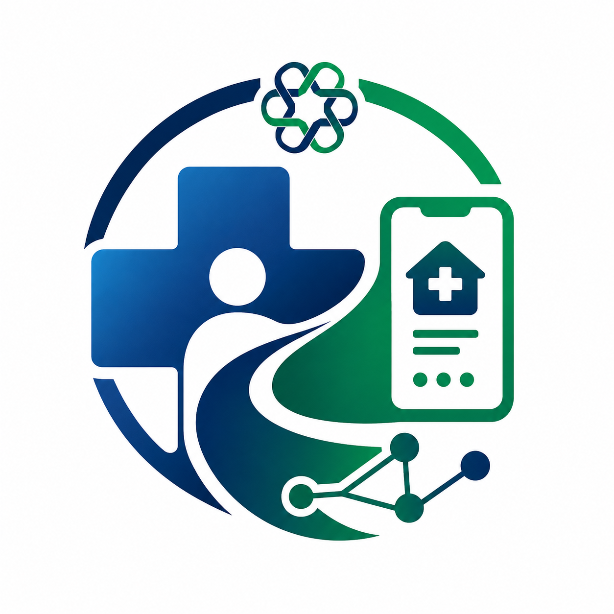

<div align="center">



# Segurança do Paciente • UPR

### Tecnologia para apoiar a transição segura do cuidado  
#### Hospital → Atenção Primária à Saúde

<br>


</div>

---

## Sobre o projeto

A organização **segurancadopaciente-upr** reúne o desenvolvimento tecnológico e a documentação do projeto:

> **Segurança na Transição do Cuidado: Aplicativo para Contrarreferência do Hospital para Atenção Primária**

O projeto está vinculado ao **Programa Pesquisa para o SUS (PPSUS) — Gestão Compartilhada em Saúde, 8ª edição**, em parceria com a **Universidade Estadual do Paraná (UNESPAR)** e a **Fundação Araucária do Paraná**.

A proposta parte de um ponto crítico da assistência em saúde: a continuidade do cuidado após a alta hospitalar. O projeto busca apoiar a **contrarreferência** entre o hospital e a Atenção Primária à Saúde por meio de uma solução digital em desenvolvimento.

---

## Propósito

Conectar os pontos da jornada do paciente com foco em:

- **Segurança do paciente** durante a transição do cuidado;
- **Comunicação assistencial** entre hospital e atenção primária;
- **Continuidade do acompanhamento** após a alta;
- **Tecnologia aplicada ao SUS**, orientada à pesquisa e à saúde pública.

<div align="center">

```text
        HOSPITAL  ───────►  CONTRARREFERÊNCIA  ───────►  ATENÇÃO PRIMÁRIA
      Alta e informações       Solução digital             Continuidade do cuidado
```

</div>

---

## Identidade do projeto

| Elemento | Significado |
|---|---|
| 🏥 Hospital | Origem da transição do cuidado e das informações de alta |
| 🏠 Atenção Primária | Continuidade do acompanhamento do paciente no território |
| 🔄 Conexão | Fluxo de contrarreferência entre serviços de saúde |
| 💻 Tecnologia | Aplicativo e recursos digitais em desenvolvimento |
| 🛡️ Segurança | Redução de falhas na continuidade assistencial |

---

## Escopo tecnológico

Esta organização poderá concentrar artefatos técnicos relacionados ao projeto, como:

- aplicação e interfaces do sistema;
- serviços de integração e persistência de dados;
- documentação técnica e funcional;
- protótipos, fluxos e decisões de arquitetura;
- materiais de apoio para pesquisa e desenvolvimento.

> Os repositórios, tecnologias e módulos serão documentados nesta organização conforme forem definidos e publicados pela equipe.

---

## Programa e vínculo institucional

| Informação | Descrição |
|---|---|
| **Projeto** | Segurança na Transição do Cuidado: Aplicativo para Contrarreferência do Hospital para Atenção Primária |
| **Programa** | Pesquisa para o SUS — PPSUS: Gestão Compartilhada em Saúde, 8ª edição |
| **Ciclo previsto** | 2026–2028 |
| **Instituição vinculada** | Universidade Estadual do Paraná — UNESPAR |
| **Área acadêmica** | Colegiado de Enfermagem / UNESPAR |
| **Coordenação do projeto** | Prof.ª Dr.ª Verusca Soares de Souza |

---

## Princípios

```yaml
seguranca_do_paciente: prioridade
continuidade_do_cuidado: essencial
saude_digital: aplicada_ao_SUS
privacidade_e_etica: indispensaveis
pesquisa_e_inovacao: orientadas_a_impacto
```

---

## Aviso de responsabilidade

Este projeto possui finalidade de **pesquisa e desenvolvimento em saúde digital**. Qualquer solução disponibilizada nesta organização deve ser utilizada conforme a validação institucional, ética, técnica e assistencial aplicável.

Nenhum conteúdo ou software aqui publicado substitui protocolo clínico, avaliação profissional ou diretriz oficial do serviço de saúde.

---

<div align="center">

### Segurança na transição do cuidado começa com informação conectada.

**PPSUS • UNESPAR • Saúde Digital para o SUS**

</div>
